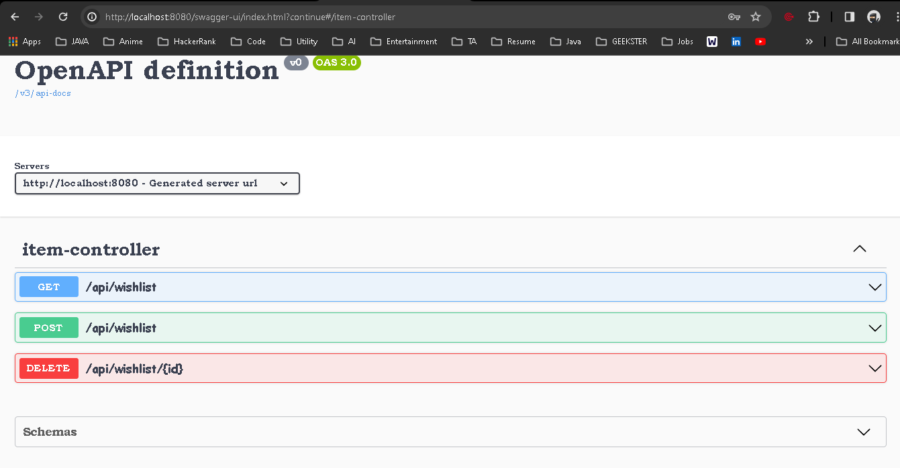

<h1 align="center"> Wishlist Management </h1>

<p align="center">
    <a href="https://www.java.com/" target="_blank">
        
    </a>
    <a href="https://maven.apache.org/" target="_blank">
        
    </a>
    <a href="https://spring.io/projects/spring-boot" target="_blank">
        
    </a>
   <a href="https://spring.io/projects/spring-security" target="_blank">
    
</a>
 
</p>

Wishlist Management is a Spring Boot project tailored for employees to efficiently manage their wishlists. Authenticated employees can securely access and manipulate their wishlist items, ensuring privacy and security. With features like adding, removing, and updating wishlist items, Wishlist Management empowers employees to organize their desired items conveniently and securely within the platform.


<hr>
## Dependencies

- [Spring Boot Starter Data JPA](https://mvnrepository.com/artifact/org.springframework.boot/spring-boot-starter-data-jpa): Provides support for Spring Data JPA, enabling easy interaction with databases using JPA.
- [Spring Boot Starter Validation](https://mvnrepository.com/artifact/org.springframework.boot/spring-boot-starter-validation): Includes validation support for Spring MVC applications.
- [Spring Boot Starter Web](https://mvnrepository.com/artifact/org.springframework.boot/spring-boot-starter-web): Provides basic web support, including embedded Tomcat server and Spring MVC.
- [MySQL Connector/J](https://mvnrepository.com/artifact/com.mysql/mysql-connector-j): JDBC driver for connecting to MySQL databases.
- [Lombok](https://mvnrepository.com/artifact/org.projectlombok/lombok): Reduces boilerplate code by providing annotations to generate getters, setters, constructors, and more.
- [Spring Boot Starter Test](https://mvnrepository.com/artifact/org.springframework.boot/spring-boot-starter-test): Includes dependencies for testing Spring Boot applications.
- [Spring Boot Starter Security](https://mvnrepository.com/artifact/org.springframework.boot/spring-boot-starter-security): Provides security features for Spring Boot applications, including authentication and authorization.
- [Springdoc OpenAPI Starter WebMVC UI](https://mvnrepository.com/artifact/org.springdoc/springdoc-openapi-starter-webmvc-ui): Integrates OpenAPI documentation into Spring Boot applications.

## Endpoints

### Register a New User

- **URL:** `/home/register`
- **Method:** `POST`
- **Description:** Registers a new user.
- **Request Body:**
  - JSON object representing the user to be registered
  - Includes details such as username, email, password, etc.
- **Response Body:**
  - Success message if the user is registered successfully
  - Error message if the user already exists or if there's an internal server error


### Login (Spring Security)

- **URL:** `/login`
- **Method:** `POST`
- **Description:** Spring Security login endpoint.
- **Request Body:**
  - Form data in x-www-form-urlencoded format
  - Includes fields such as username and password
- **Response Body:**
  - Authentication token or session cookie if login is successful
  - Error message if login fails or if there's an internal server error


### Get All Wishlist Items

- **URL:** `/api/wishlist`
- **Method:** `GET`
- **Description:** Retrieves all items in the user's wishlist.
- **Request Body:** None
- **Response Body:**
  - List of items in the wishlist
  - Each item includes its details such as name, description, etc.


### Add an Item to Wishlist

- **URL:** `/api/wishlist`
- **Method:** `POST`
- **Description:** Adds a new item to the user's wishlist.
- **Request Body:**
  - JSON object representing the item to be added
  - Includes details such as name, description, etc.
- **Response Body:**
  - Success message if the item is added successfully
  - Error message if the item already exists or if there's an internal server error


### Delete an Item from Wishlist

- **URL:** `/api/wishlist/{id}`
- **Method:** `DELETE`
- **Description:** Deletes an item from the user's wishlist based on its ID.
- **Path Variable:**
  - `id`: ID of the item to be deleted
- **Response Body:**
  - Success message if the item is deleted successfully
  - Error message if there's an internal server error


## Testing

The WishlistManagement application includes comprehensive unit and integration tests to ensure the correctness and reliability of its features. The tests cover various scenarios and use cases, including but not limited to:
- Testing controller endpoints using Spring MVC's MockMvc framework.
- Testing service layer methods for business logic and data manipulation.
- Testing repository layer methods for database interactions.
- Testing security configurations and authentication mechanisms.

To run the tests:
1. Navigate to the project directory in your terminal.
2. Execute the following Maven command:

   ```bash
   mvn test
   
## Swagger 
Additionally, the project includes Swagger support for API documentation. Swagger provides interactive documentation for your RESTful APIs, allowing developers to explore and test endpoints easily. With Swagger, you can enhance the usability and understanding of your API, making it easier for developers to integrate with your system.


## Setup

1. Clone the repository:

   ```bash
   git clone https://github.com/your_username/WishlistManagement.git
   ```

2. Navigate to the project directory:

   ```bash
   cd WishlistManagement
   ```

3. Build the project using Maven:

   ```bash
   mvn clean install
   ```

4. Run the application:

   ```bash
   mvn spring-boot:run
   ```

## Database Setup

To set up the database for the WishlistManagement application, follow these steps:

1. Open the `application.properties` file in the project's `src/main/resources` directory.

2. Configure the datasource properties according to your MySQL database setup:
   ```
   spring.datasource.url=jdbc:mysql://localhost:3306/Employee_Wishlist?autoReconnect=true&useSSL=false&createDatabaseIfNotExist=true
   spring.datasource.username=your_database_username
   spring.datasource.password=your_database_password
   spring.datasource.driverClassName=com.mysql.cj.jdbc.Driver
   spring.jpa.hibernate.ddl-auto=update
   ```

   Replace `your_database_username` and `your_database_password` with your MySQL database credentials.

3. Optionally, configure Hibernate properties for SQL logging:
   ```
   spring.jpa.properties.hibernate.show_sql=true
   spring.jpa.properties.hibernate.use_sql_comments=true
   spring.jpa.properties.hibernate.format_sql=true
   ```

   These properties enable SQL logging in the console for debugging purposes.

## Default Spring Security Credentials

By default, Spring Security is enabled in the WishlistManagement application.

Ensure to replace the default credentials with your own before deploying the application to production.

## Usage

- Access the application through your web browser at `http://localhost:8080`.
- Use the provided API endpoints to interact with wishlists programmatically.

## Contributing

Contributions are welcome! Please feel free to submit pull requests or open issues for any improvements or features you'd like to see.

## License

This project is licensed under the MIT License - see the [LICENSE](LICENSE) file for details.
